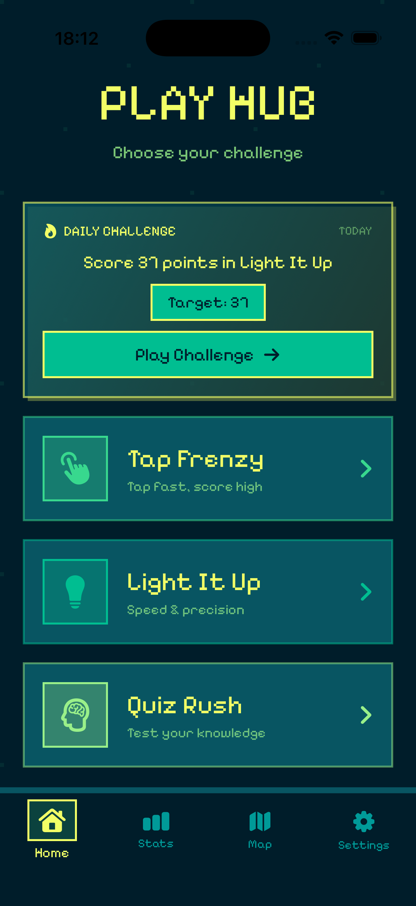
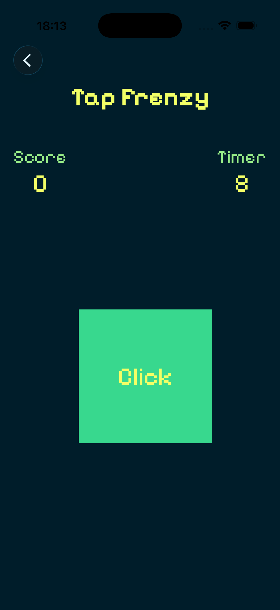
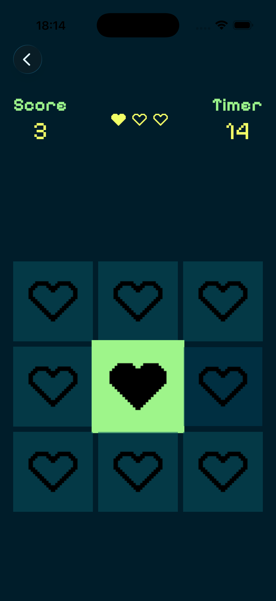
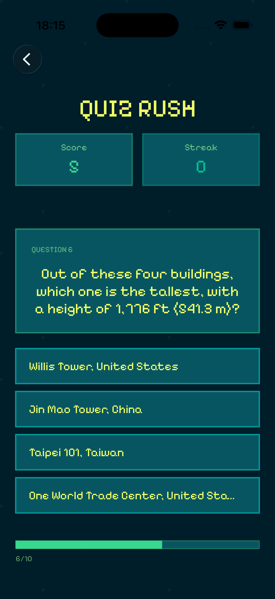

# Play Hub 

A pixel-art-themed iOS mini-game collection built with SwiftUI. Play Hub bundles three distinct
games under one roof, with cross-game stats tracking, daily challenges, location tagging, and
push notification reminders.






---

## Table of Contents

- [Architecture Overview](#architecture-overview)
- [Project Structure](#project-structure)
- [Features](#features)
- [Games](#games)
- [Known Limitations](#known-limitations)

---

## Architecture Overview

Play Hub follows the **MVVM (Model–View–ViewModel)** pattern throughout, leveraging modern
SwiftUI and Swift Concurrency primitives.

```
┌───────────────────────────────────────────────────┐
│                      Views                        │
│  MainMenuView · StatsView · MapView · SettingsView│
│  TapFrenzyView · LightItUpView · QuizView         │
└────────────────────┬──────────────────────────────┘
                     │  observes / binds
┌────────────────────▼──────────────────────────────┐
│                   ViewModels                      │
│  TapFrenzyVM · LightItUpVM · QuizVM               │
│  MapVM · SettingsVM                               │
└────────────────────┬──────────────────────────────┘
                     │  reads / writes
┌────────────────────▼──────────────────────────────┐
│                    Services                       │
│  GameSessionService  – persist & load sessions    │
│  DailyChallengeService – generate daily goals     │
│  NotificationService – schedule reminders         │
│  LocationService     – capture play location      │
│  AuthenticationService – biometric gate for reset │
└────────────────────┬──────────────────────────────┘
                     │
┌────────────────────▼──────────────────────────────┐
│                    Models                         │
│  GameSession · DailyChallenge                     │
│  QuizModel · Question · QuizCategory/Difficulty   │
│  GameMode · Card · Level                          │
└───────────────────────────────────────────────────┘
```

### Key Design Decisions

| Concern | Approach |
|---|---|
| State management | Swift `@Observable` macro (iOS 17+) |
| Async timers | `Combine` `Timer.publish` + Swift `async/await` |
| Persistence | `UserDefaults` via `@AppStorage` and JSON encode/decode |
| Navigation | Custom `NavigationRouter` singleton hides the tab bar while in-game |
| Notifications | `UNUserNotificationCenter` wrapped behind `NotificationServiceProtocol` |
| Location | `CoreLocation` wrapped in an `@Observable` singleton |
| Biometrics | `LocalAuthentication` guards destructive data-reset action |

---

## Project Structure

```
IosTutorial/
├── App/
│   └── IosTutorialApp.swift        # @main entry, tab routing, location bootstrap
├── Models/
│   ├── GameSession.swift           # GameSession struct + GameMode enum
│   ├── DailyChallenge.swift        # DailyChallenge struct + ChallengeStatus enum
│   └── QuizRush/
│       └── QuizModel.swift         # Question, QuizCategory, QuizDifficulty
├── ViewModels/
│   ├── TapFrenzy/TapFrenzyVM.swift
│   ├── LightItUp/LightItUpVM.swift
│   ├── QuizRush/QuizVM.swift
│   └── Other/
│       ├── MapVM.swift
│       └── SettingsVM.swift
├── Views/
│   ├── Tabs/
│   │   ├── MainMenuView.swift
│   │   ├── StatsView.swift
│   │   ├── SettingsView.swift
│   │   └── Map/MapView.swift
│   └── Games/
│       ├── TapFrenzy/TapFrenzyView.swift
│       ├── LightItUp/LightItUpView.swift
│       └── QuizRush/
│           ├── QuizSetupView.swift
│           └── QuizView.swift
├── Services/
│   ├── GameSessionService.swift
│   ├── DailyChallengeService.swift
│   ├── NotificationService.swift
│   ├── LocationService.swift
│   └── AuthenticationService.swift
├── Shared/
│   ├── GameStorage.swift           # @AppStorage high-score wrappers
│   ├── NavigationRouter.swift      # Tab-bar visibility controller
│   ├── GameOverView.swift          # Reusable game-over screen
│   ├── Extensions.swift
│   └── Components/                 # Shared pixel-art UI components
├── Fonts/                          # Pixelify Sans font files
└── Assets.xcassets/
```

---

## Features

### Navigation & UI
- Custom animated **tab bar** with four tabs: Home, Stats, Map, Settings
- Tab bar automatically hides with a slide-out animation when entering any game
- Pixel-art design language using the **Pixelify Sans** font throughout

### Stats
- Per-game **all-time high scores** displayed with a visual bar chart
- **Recent sessions** list showing the game mode, score, and relative timestamp
- Persistent high scores stored via `@AppStorage`

### Daily Challenge
- A new challenge is auto-generated every day targeting one of the three games
- Displays the challenge goal on the home screen when enabled
- Automatically marked complete when the target score is reached mid-session
- Can be toggled on/off from Settings

### Push Notifications
- Optional **daily reminder** notification, configurable to any time of day
- Uses a repeating `UNCalendarNotificationTrigger` so no re-setup is needed
- Enable/disable and time picker surfaced in the Settings tab

### Location Tagging
- Each game session is tagged with the device's GPS coordinates at the time of play
- Session locations are plotted on an interactive **MapKit map** in the Map tab
- Permission is requested once on first launch (`whenInUse` authorization)

### Settings
- Toggle daily challenge and daily reminder independently
- Biometric-gated **Reset Game Data** action (Face ID / Touch ID / passcode)

### Share
- Share score from the Game Over screen via the native iOS share sheet

---

## Games

### Tap Frenzy
A reflex game where a button moves around the screen every 2 seconds. Tap it as many times
as possible within **10 seconds**. Rapid consecutive taps (< 0.5 s apart) build a **score
multiplier** that compounds your score. Final score is saved and checked against your high
score and today's daily challenge target.

| Detail | Value |
|---|---|
| Duration | 10 seconds |
| Daily challenge target | 100 – 200 taps |
| Multiplier | Increments for taps < 0.5 s apart |

### Light It Up
A whack-a-mole type game played on a grid of cards. Cards briefly **light up** one at a time;
tap a lit card to score, tap a dark card to lose a life. The grid grows and cards stay lit for
shorter durations as time passes, driven by a **four-level difficulty curve** that scales
automatically over the 60-second round.

| Level | Cards | Lit duration | Time window |
|---|---|---|---|
| L1 | 3 | 1.5 s | 46 – 59 s remaining |
| L2 | 4 | 1.2 s | 31 – 45 s remaining |
| L3 | 6 | 1.0 s | 16 – 30 s remaining |
| L4 | 9 | 0.8 s | 0 – 15 s remaining |

Lives: 3. Game ends on last life lost or timer expiry.

### Quiz Rush
A trivia game powered by the **Open Trivia Database (OpenTDB) API**. Before starting, choose a
**category** (General, Science, History, Geography, and more) and a **difficulty** (Easy, Medium,
Hard). Answer as many questions correctly as possible. The setup screen also shows the current
daily challenge parameters when a Quiz Rush challenge is active.

---

## Known Limitations

- **Light It Up difficulty curve** — The level thresholds (L1–L4) are hardcoded to fixed time
  windows. There is no smooth algorithmic ramp, and difficulty settings are not user-configurable.
- **Light It Up card layout** — Cards are not procedurally generated; the grid is rebuilt from a
  fixed count per level, not from the player's current performance.
- **No starting/intro screen for Tap Frenzy and Light It Up** — Both games begin immediately
  with no countdown or instruction screen. Quiz Rush has a setup screen; the other two do not.
- **Light It Up visual bugs** — Heart/life icons may render with a black tint on certain device
  configurations instead of the intended colour.
- **Status bar tint in-game** — The status bar can turn black when transitioning into a game
  view on some devices.
- **Location fallback is silent** — When location permission is denied, sessions are saved with
  `(0, 0)` coordinates without any user-visible warning.
- **Quiz Rush network dependency** — The game requires an active internet connection to fetch
  questions from OpenTDB. There is no offline fallback or cached question bank.
- **No iCloud sync** — All data (`UserDefaults`) is local to the device. Scores and sessions are
  lost if the app is deleted or the device is changed.
- **Light-mode only** — The app is pinned to `.preferredColorScheme(.light)` and does not
  honour the system dark mode setting.
